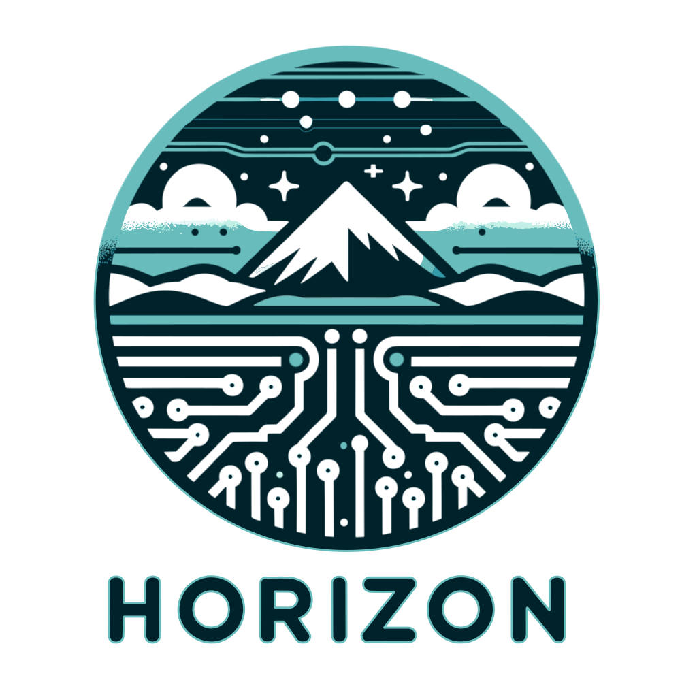

.. _readme:

Horizon
=======

|Repo Status| |PyPI| |Docker image| |PyPI License| |PyPI Python Version| |Documentation| |Build Status| |Coverage|

.. |Repo Status| image:: https://www.repostatus.org/badges/latest/active.svg
    :target: https://github.com/MobileTeleSystems/horizon
.. |PyPI| image:: https://img.shields.io/badge/pypi-download-orange
    :target: https://pypi.org/project/data-horizon/
.. |Docker image| image:: https://img.shields.io/badge/docker-pull-yellow
    :target: https://hub.docker.com/u/mtsrus/horizon-backend
.. |PyPI License| image:: https://img.shields.io/pypi/l/data-horizon.svg
    :target: https://github.com/MobileTeleSystems/horizon/blob/develop/LICENSE.txt
.. |PyPI Python Version| image:: https://img.shields.io/pypi/pyversions/data-horizon.svg
    :target: https://badge.fury.io/py/data-horizon
.. |Documentation| image:: https://readthedocs.org/projects/horizon/badge/?version=stable
    :target: https://data-horizon.readthedocs.io/
.. |Build Status| image:: https://github.com/MobileTeleSystems/horizon/workflows/Tests/badge.svg
    :target: https://github.com/MobileTeleSystems/horizon/actions
.. |Coverage| image:: https://codecov.io/gh/MobileTeleSystems/horizon/branch/develop/graph/badge.svg?token=RIO8URKNZJ
    :target: https://codecov.io/gh/MobileTeleSystems/horizon

|Logo|

What is Horizon?
----------------

Horizon is an application that implements simple HWM Store. Right now it includes:

* REST API
* Python client

Goals
-----

* Allow users to save and fetch *HWM* (High Water Mark) items. These are ``name+type+value`` triples with few optional fields (``description``, ``entity``, ``expression``).
* Avoid confusion between different user's data by separating HWMs to different *namespaces*. HWMs is created within namespace, each ``namespace name`` + ``HWM name`` is unique.
* Allow users to get HWM change history, to determine who and when changed a specific HWM value and other fields.

Non-goals
---------

* This is not a data storage, it is not designed to store raw table rows. It is designed to store only HWM values, e.g. *max value* of a specific table column, list of handled files and so on.
* Attaching machine-readable metadata for HWMs (like ``table``, ``process``, ``origin``) is not supported. This should be stored somewhere else.

Limitations
-----------

* Currently Horizon does not implement any kind of access control, so **anyone can change anything**.
* HWM types and values are not checked, and can contain anything. It is up to user how to parse fetched values and perform validation.
* HWMs cannot be renamed or moved between namespaces. These operations could be performed only by creating new HWM in desired namespace, and deleting the old one.

.. documentation

Documentation
-------------

See https://data-horizon.readthedocs.io/
